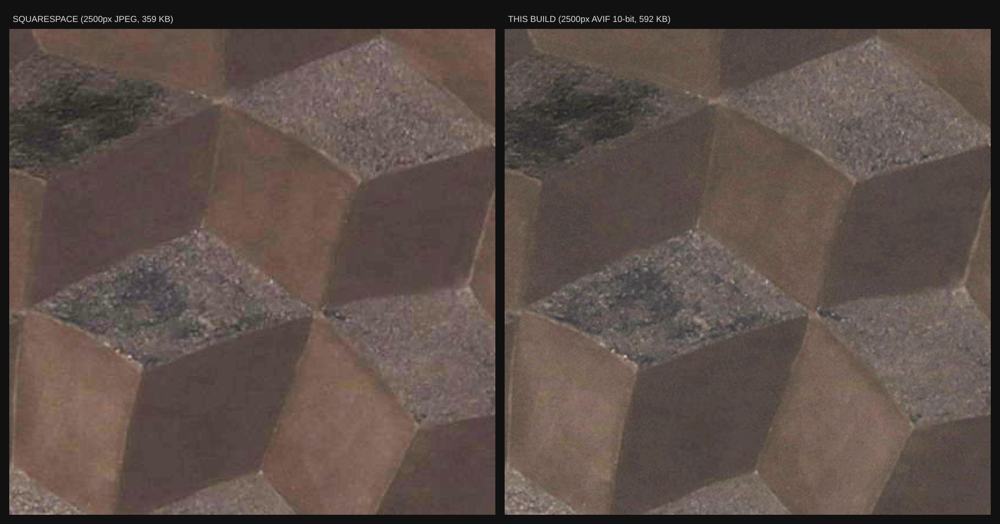

# meia-g.art

The website for Meia G — a static site built from the catalogue in `data/` and
the camera masters in `masters/`. No CMS, no page builder, no image service in
front of it. The point is that nothing between the master file and the viewer
is allowed to touch the image.

```
npm install
npm run build          # derivatives + pages  → dist/
npm run build:pages    # pages only, reuse existing derivatives (fast)
npm run check          # verify every asset the built pages reference exists
npm run serve          # preview dist/ at http://localhost:4173
```

---

## Why this exists

Squarespace re-encodes every upload and caps the long edge at **2500px**. Asking
for the original returns the same capped file:

```
$ curl -sI ".../R-00-01_HD.jpg?format=original" | grep content-length
content-length: 367589        # identical to ?format=2500w
```

For most photography that is invisible. For this work it is not. These
paintings are built on controlled black grounds, and their entire subject is
the *narrow* separation between one dark plane and the next. On R-02-06,
**100% of the canvas sits below 48/255** — the whole painting occupies the
darkest 19% of the tonal range, and R-02-04 is 99.5% the same. That is exactly
the range a JPEG encoder is designed to spend its bits on last.

Measured on R-02-06 at 2000px wide, scoring mean absolute error in the shadow
region (pixels under 48/255) rather than overall average, since that is where
the painting lives:

| encoding | size | PSNR | shadow MAE | worst pixel error |
| --- | ---: | ---: | ---: | ---: |
| JPEG q60 4:2:0 — *what a platform re-encode looks like* | 82 KB | 41.68 | 1.488 | **109** |
| WebP q90 | 171 KB | 43.75 | 1.221 | 65 |
| JPEG q92 4:4:4 mozjpeg | 421 KB | 45.10 | 1.016 | 27 |
| AVIF q70 8-bit 4:4:4 | 111 KB | 44.04 | 1.172 | 36 |
| AVIF q70 10-bit 4:4:4 | 110 KB | 44.19 | 1.154 | 46 |
| **AVIF q82 10-bit 4:4:4** — display tier | 255 KB | 45.26 | 1.033 | 33 |
| **AVIF q88 10-bit 4:4:4** — zoom tier | 634 KB | 46.94 | **0.835** | **24** |

That worst-case error of **109/255** in the first row is the visible artefact —
a single shadow pixel landing 43% of the way up the tonal range from where it
belongs. It is what produces the banded, blocky ground in the comparison
screenshot, and no setting inside Squarespace can avoid it.

The display tier beats a high-quality JPEG on both measures at 60% of the
bytes. The zoom tier is better than anything a platform will serve at any size.



*Left: what meia-g.art serves today. Right: the same master through this
pipeline. Both 2500px, so the difference is encoding alone — note the smeared
facet edges and the paint grain collapsing into blotches on the left. Crop
shown at 2× with shadows lifted equally on both sides.*

R-00-01 was chosen for that comparison because it is the **least** affected
work in the catalogue: its master is already 2500px, so nothing is lost to the
size cap and only the re-encode is visible. Most of the others are 3300–4600px
masters, which lose roughly a third of their linear resolution on top of what
is shown above. `docs/reported-problem.jpg` is the original side-by-side that
prompted this.

Three decisions do most of that work, all in `scripts/images.js`:

- **`pipelineColourspace('rgb16')`** — resampling happens in 16-bit, so the dark
  gradients are not quantised before the encoder sees them.
- **`bitdepth: 10`** — 10-bit AVIF has finer steps near black, which is where
  every visible band in this work occurs. It costs nothing: at q70 the 10-bit
  file came out *smaller* than the 8-bit one.
- **`chromaSubsampling: '4:4:4'`** — 4:2:0 throws away three quarters of the
  colour resolution and is what turns the chrome edges in R-01 to mush.

Downscaled tiers get a light sharpen to compensate for resampling loss. The
full-resolution file never does — it is the painting, untouched.

> **sharp ≥ 0.35 is required.** Sharp 0.34's prebuilt binaries reject
> `bitdepth: 10` outright (*"Expected 8 for bitdepth when using prebuilt
> binaries"*). Don't loosen the version in `package.json` — dropping to 8-bit
> would quietly undo the point of the exercise.

---

### Verified, not assumed

- Colour is carried through intact. Master and derivative, both normalised to
  8-bit sRGB, differ by **less than 0.5/255 on every channel**, with the deltas
  mixed in sign — lossy rounding, not a cast. sRGB profiles are attached to
  every output.
- The full-resolution file is **not** in any `srcset`, so no browser pulls a
  600 KB image to lay out a thumbnail. It is fetched only when the viewer opens.
- Fallback JPEGs are 4:4:4 with profiles attached.
- Viewer checked in Chromium: 1:1 reports actual size, panning clamps at the
  edges, `Esc` restores scroll, no console errors.

`npm run check` re-runs the structural half of that on every build.

## Structure

```
data/site.json          name, nav, contact, which work is the hero
data/works.json         the catalogue — one object per work
data/manifest.json      generated; what the image build produced
content/*.md            biography, cv, statement, refletismo
masters/                camera originals (gitignored — see below)
scripts/build.js        page generation
scripts/images.js       the encoder settings above
site/styles, site/scripts   css and the zoom viewer
dist/                   the built site — this is what deploys
```

`dist/` is committed. It contains the derivatives, so the site deploys without
anyone needing the 1.3 GB of masters.

## The masters

They are not in git. Keep them in Dropbox and point the build at them:

```
MASTERS_DIR=/path/to/dropbox/folder npm run build
# or: ln -s /path/to/dropbox/folder masters
```

The layout the build expects is the one the files already have — `R-01-03/R-01-03_HD.jpg`
and so on. `master` in `works.json` is the path relative to that folder.

Naming, as used in the archive: `_HD/_MD/_LD` are size variants of the flat
reproduction, `_WW` is the white-wall install view, `_WF` the wider gallery
view, `_OR` the original angled shot. The build uses the largest flat
reproduction for `master`, `_WW` for `install`, `_WF` for `room`.

## Adding a work

1. Put the files in `masters/R-0X-0Y/`.
2. Add an object to `works` in `data/works.json` — `id`, `series`, `master`, and
   whatever of `year` / `medium` / `dimensions` / `alt` / `description` is known.
3. `npm run build`.

Only the new work is encoded. Anything already in `dist/img` with a matching
entry in `data/manifest.json` is left alone, so this takes a minute rather than
the hour a first build takes. Use `node scripts/build.js --force` to re-encode
everything from scratch — needed if you change the settings in `images.js`, or
if you replace a master with a better photograph under the same filename.

Anything left `null` is simply omitted from the page. Nothing is invented and
no placeholder is printed. Fields still outstanding are listed in
`CATALOGUE-GAPS.md`, regenerated on every build.

## The viewer

Clicking a work opens it at full resolution — scroll or pinch to zoom, drag to
pan, `0` to fit, `1` for actual size, `Esc` to close. The full-resolution file
is only fetched when someone opens the viewer, so the page stays light for
everyone who doesn't.

---

## Deploying

The build is plain static files. Any of these work; all of them serve the
images untouched, which is the whole requirement.

**Cloudflare Pages** — connect the repo, build command `npm run build:pages`,
output directory `dist`. Free, fast, and unmetered bandwidth for images.

**Netlify** — same, `netlify.toml` is not needed for a build this simple.

**GitHub Pages** — serve `dist/` from the branch. `dist/CNAME` already contains
`www.meia-g.art`.

Use `build:pages` in CI rather than `build`: the masters are not in the repo, so
CI must reuse the committed derivatives. Run the full `build` locally whenever
images change, and commit the result.

### Pointing meia-g.art at it

The domain is currently registered through Squarespace and serving the
Squarespace site. To move it, add the host's records at the registrar:

- `CNAME` on `www` → the host's target (e.g. `<project>.pages.dev`)
- apex `meia-g.art` → the host's apex record, then redirect apex to `www`

Keep the Squarespace site up until DNS has propagated and the new site is
verified — nothing here touches the existing one, and reverting is just
switching the records back.
